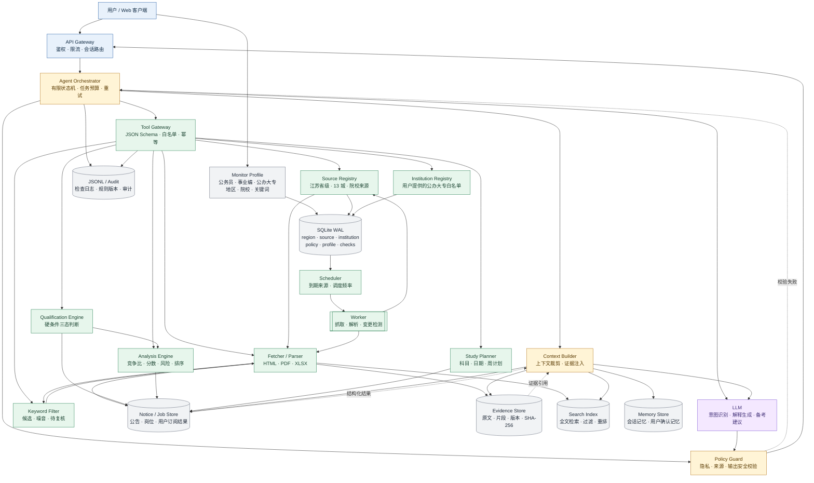
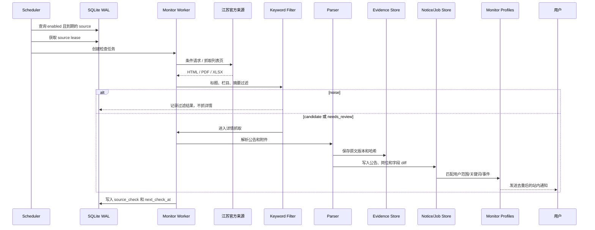
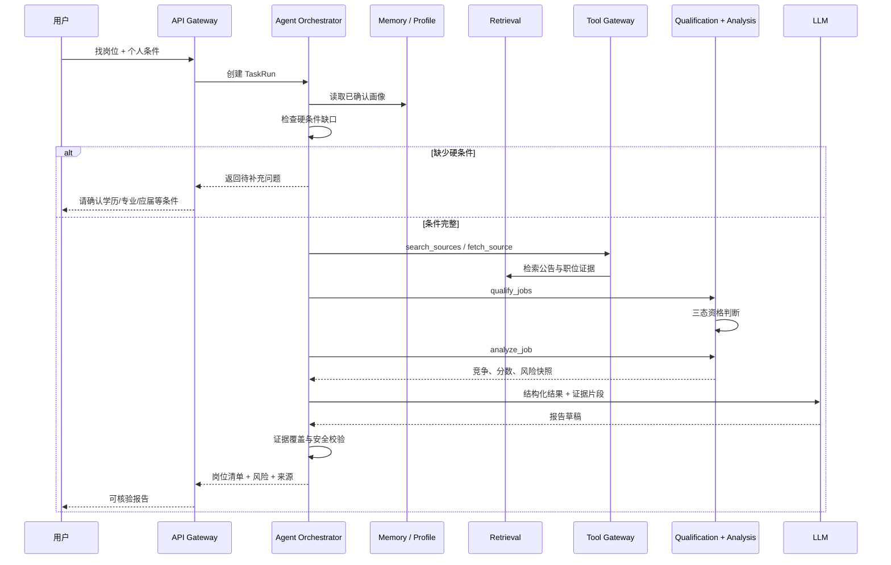

# Aurora 架构图

下面这张图展示江苏省级、13 个地级市和公办大专招聘监控 MVP 的主要组件和数据流。将本文件粘贴到支持 Mermaid 的 Markdown 查看器即可渲染。

## 一次监控任务

## 一次“找岗位”请求

## 关键边界

- LLM 不直接抓取网页，只能通过 `Tool Gateway` 调用工具。
- 资格结论、竞争比和风险指标由规则/分析引擎计算。
- `Evidence Store` 保存原文版本，回答必须引用证据片段。
- 用户长期记忆只有在用户确认后才写入。
