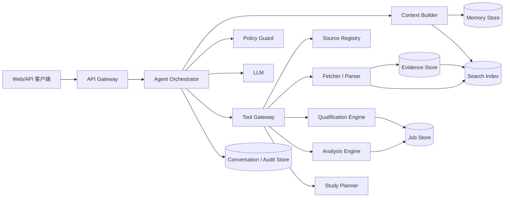
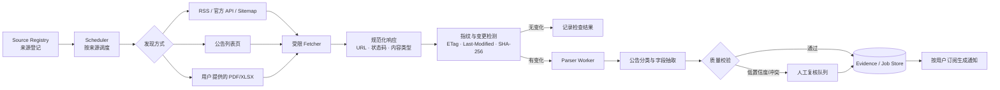

# Aurora 系统架构设计

本文是 [需求规格](requirements.md) 的工程设计补充。目标是先实现一个可审计的单省份 MVP，再在数据质量稳定后扩展省份和考试类型。

## 1. 设计原则

1. **模型做编排，代码做判定**：大模型负责意图识别、字段抽取、解释和计划生成；资格匹配、竞争比、来源时效和排序由确定性模块完成。
2. **证据优先**：任何岗位事实必须关联来源片段和抓取时间；检索不到证据时，输出未知，不使用模型常识补全。
3. **显式不确定性**：`unknown`、`待核实`、`数据不足` 是一等状态，不等同于符合或低风险。
4. **最小化记忆**：只保存用户确认过且对未来有用的偏好；单次任务产生的推断、敏感信息和原始对话不自动长期保存。
5. **可恢复和可观测**：每次工具调用、来源版本、规则版本和最终回答都可追踪，失败可重试而不重复写入。

## 2. 总体组件



### 2.1 组件职责

| 组件 | 职责 | MVP 建议实现 |
| --- | --- | --- |
| API Gateway | 鉴权、限流、会话路由、统一错误格式 | FastAPI/HTTP |
| Agent Orchestrator | 状态机、工具选择、重试、预算和回答组装 | Python 服务；禁止任意代码执行 |
| Context Builder | 按任务构造最小上下文、裁剪历史和证据 | 独立纯函数模块 |
| Policy Guard | 隐私、来源、越权和高风险回答检查 | 工具前置 + 输出后置双检 |
| Source Registry | 官方来源白名单、抓取周期和健康状态 | PostgreSQL 表 |
| Fetcher/Parser | 获取 HTML/PDF/XLSX，解析并保留原文 | 队列 worker；遵守站点规则 |
| Qualification Engine | 硬条件三态判断和淘汰原因 | 规则引擎，单元测试覆盖 |
| Analysis Engine | 竞争比、分数口径、排序和风险 | 确定性 Python 模块 |
| Study Planner | 把科目、日期、时长变成周计划 | 规则 + LLM 表述 |
| Evidence Store | 原文、片段、版本、哈希和来源关系 | 对象存储 + PostgreSQL 元数据 |
| Job Store | 标准化岗位、公告、分析结果 | PostgreSQL |
| Search Index | 关键词、过滤和语义检索 | PostgreSQL FTS 起步，后续向量库 |
| Memory Store | 用户确认画像、偏好和任务摘要 | PostgreSQL；敏感字段拒绝入库 |
| Audit Store | 工具调用、规则版本、回答证据链 | PostgreSQL/结构化日志 |

建议的代码目录：

```text
aurora/
  app/
    api/                 # HTTP 路由、鉴权、请求模型
    agent/               # 意图识别、状态机、回答组装
    context/             # 上下文预算、摘要、证据注入
    policy/              # 隐私、来源、输出安全策略
    tools/               # Tool Gateway 与工具 schema
    qualification/       # 硬条件三态规则和专业匹配
    analysis/             # 竞争比、分数、排序、风险
    planning/             # 备考计划生成与调整
    retrieval/            # 全文检索、重排、引用组装
    sources/              # 来源登记、抓取、解析、版本管理
    memory/               # 会话、长期记忆及用户确认流程
    models/               # ORM、领域对象、枚举
  workers/                # 抓取、解析和变更检测异步任务
  migrations/             # 数据库迁移
  tests/
    unit/                 # 规则、计算、上下文和策略
    integration/          # 工具、数据库、检索
    e2e/                   # 从来源到回答的链路
  config/                 # 来源白名单和环境配置模板
```

`models` 只定义数据契约，不能反向依赖 `agent`；`tools` 是唯一允许编排层访问外部数据的边界；`qualification` 和 `analysis` 应保持无网络、无模型依赖，便于复现和测试。

## 3. 请求生命周期

一次 `找岗位` 请求按以下状态机运行：

```text
RECEIVED
  -> PROFILE_EXTRACTED       从消息抽取字段并标注来源/置信度
  -> NEEDS_CLARIFICATION     缺少硬条件时返回问题，不调用抓取工具
  -> SOURCE_SELECTED         选择指定省份的来源白名单
  -> EVIDENCE_RETRIEVED      读取缓存或触发受限抓取
  -> JOBS_NORMALIZED         将职位表转成统一 schema
  -> QUALIFIED                三态资格判断
  -> ANALYZED                计算竞争指标、分数与风险
  -> RESPONSE_DRAFTED        LLM 根据证据生成可读报告
  -> RESPONSE_VERIFIED       证据覆盖、隐私和措辞检查
  -> COMPLETED / FAILED
```

每个状态产生幂等事件，事件包含 `request_id`、`conversation_id`、`user_id`、`rule_version`、`source_version` 和 `trace_id`。长任务（批量解析职位表）通过队列异步执行，前端轮询或 SSE 获取进度。

### 3.1 招聘通知监控管道

监控不是“定时让模型浏览网页”，而是一个有来源登记、抓取、变更检测和人工复核的流水线：



#### 来源登记

每个可监控入口由管理员登记，不允许用户消息直接注入任意抓取地址。建议字段：

```json
{
  "source_id": "src_zj_hrss_notice",
  "publisher": "浙江省人力资源和社会保障厅",
  "source_level": "official",
  "region": "浙江",
  "source_type": "notice_list",
  "entry_url": "https://example.gov.cn/notice",
  "allowed_domains": ["example.gov.cn"],
  "discovery": "html_list",
  "parser_profile": "gov_notice_v1",
  "check_interval_minutes": 360,
  "enabled": true,
  "last_success_at": "2026-08-15T00:00:00Z"
}
```

来源分为三类：

- **一级来源**：省/市人社、人事考试、招录机关官网，结论依据只认这一类；
- **二级来源**：学校就业网、官方组织的公开招聘专栏，只作为补充来源或发现入口；
- **用户来源**：用户主动上传或提供的文件/链接，必须标注为未验证，不能覆盖一级来源。

#### 调度策略

- 公务员和事业单位公告列表：默认每 6 小时检查一次；报名截止前 72 小时提高到每 1 小时；
- 学校招聘页面：默认每天检查一次，连续 3 次失败自动降频并告警；
- 已发现的公告详情页：列表页发生变化后立即入队，不对所有详情页高频轮询；
- 使用 `ETag`、`Last-Modified` 和内容哈希减少重复下载；设置连接超时、响应体上限和指数退避；
- 每次抓取保存 `checked_at`、HTTP 状态、重定向链、内容哈希和解析器版本，确保可重放。

#### 发现阶段的关键词过滤

公告列表页发现新链接后，先执行轻量的标题过滤，再决定是否下载详情页。这样可以把“成绩公示”“工伤送达”等人社日常政务内容挡在解析队列之外，降低抓取和模型调用成本。

过滤规则不是一个不可修改的黑名单，而是按来源、地区和考试类型版本化的规则集：

```yaml
keyword_policy: gov_recruitment_v1
include_any: [招聘, 招考, 录用, 公务员, 事业单位, 公开选聘, 公开遴选, 报名]
exclude_any: [成绩公示, 工伤送达, 工伤认定, 行政处罚, 政策解读, 执法公告,
              预算公开, 财政决算, 人事任免, 评审结果, 社保缴费]
recheck_if: [资格审查, 体检, 考察, 拟录用, 递补, 面试, 笔试]
```

处理顺序：

1. 标题、栏目名和摘要统一 Unicode、全角半角、空白和标点，建立用于匹配的规范文本，但保留原始标题；
2. 命中强排除词且没有招聘上下文时，标记 `noise`，不下载详情页；
3. 命中保留词的链接进入详情抓取；
4. 只命中弱词或同时命中排除词与保留词时，标记 `needs_review`，抓取详情页后再判断；
5. 详情正文仍需通过公告类型分类器和字段门禁，标题过滤不能直接把页面认定为招聘公告。

建议把“成绩公示”“工伤送达”“行政处罚”等作为默认强排除词，把“面试”“体检”“考察”“拟录用”“递补”作为招聘流程的保留上下文。例外规则必须有明确组合条件，例如“事业单位面试成绩公示”应保留，而单独的“成绩公示”应排除。

每条过滤结果记录：`matched_terms`、`policy_version`、`decision`（`candidate`/`noise`/`needs_review`）、`matched_title` 和 `decided_at`。管理员可以从误删/漏收通知中调整规则并生成新版本，旧版本保留以便重放历史抓取。

#### 发现与解析顺序

1. 优先使用官方 RSS、公开 API 或 sitemap；
2. 没有结构化入口时解析公告列表页，只提取标题、日期、详情 URL；
3. 对列表项执行关键词过滤，只有 `candidate` 和 `needs_review` 才进入详情抓取；
4. 详情页下载后按 MIME 类型分流：HTML、PDF、XLSX；不执行网页脚本、宏或压缩包中的可执行文件；
5. 先用确定性解析提取标题、日期、附件和职位代码，再用模型辅助分类/字段映射；
6. 模型输出必须通过 JSON Schema、字段枚举和原文片段校验，低置信度字段进入人工复核。

#### 变更检测与去重

公告主键使用 `canonical_url + publisher`；附件和正文分别保存哈希。检测到变化时生成 `EvidenceVersion`，并计算字段级 diff：新增、删除、修改、截止时间变化、附件替换。只要报名时间、职位条件、招录人数或考试科目发生变化，就标记为高优先级变更。

标题相同但 URL 不同的页面不能直接合并；通过发布机关、公告日期、正文哈希和职位代码进行二次去重。学校转载与官方公告建立 `related_source_id` 关系，不覆盖官方版本。

#### 质量门禁与通知

解析结果只有满足以下条件才进入可检索岗位库：公告标题和发布日期可识别、来源域名通过白名单、至少一段原文证据可定位。职位表字段冲突、扫描 PDF 无文本层、附件损坏或解析置信度低时进入人工复核，不直接通知为“新岗位”。

通知按用户已确认的 `region / exam_type / year / preferences` 过滤，默认只通知：新公告、报名时间变化、岗位条件变化和来源失效；同一公告同一版本只发一次。通知内容包含变化摘要、原始链接、发现时间、来源等级和“需人工核验”标签。MVP 先提供站内通知和会话消息，短信/邮件放到后续版本。

#### 监控失败处理

单个来源失败不影响其他来源。连续失败、证书错误、域名变更、疑似反爬或内容类型异常分别记录原因并告警管理员；不通过更换 IP、绕过验证码或登录限制来“修复”抓取。来源恢复后先执行全量校验，再恢复增量通知，避免补发大量重复消息。

## 4. 工具调用设计

模型只能通过 Tool Gateway 调用登记工具。工具输入输出必须是 JSON Schema；工具不得直接把未经校验的网页文本拼入最终回答。

### 4.1 工具目录

| 工具 | 输入 | 输出 | 副作用 |
| --- | --- | --- | --- |
| `search_sources` | `region, exam_type, year, query` | 来源摘要、URL、可信度、更新时间 | 只读 |
| `fetch_source` | `source_id, url, force_refresh=false` | `evidence_id, version, status, excerpts` | 写入证据版本 |
| `parse_job_document` | `evidence_id` | `document_id, jobs[], parse_warnings[]` | 幂等写入岗位 |
| `get_jobs` | 结构化过滤条件、分页 | 岗位摘要和证据引用 | 只读 |
| `qualify_jobs` | `profile_id, job_ids[]` | 每个硬条件的三态结果和原因 | 写入分析快照 |
| `analyze_job` | `job_id, historical_data_policy` | 竞争比、分数样本、风险、置信度 | 写入分析快照 |
| `build_study_plan` | `job_id, exam_date, weekly_hours` | 阶段/周计划、依据和缺口 | 写入计划草稿 |
| `save_memory` | 记忆类型、字段、用户确认凭证 | `saved, memory_id` | 仅用户确认后写入 |
| `get_memory` | `user_id, task_scope` | 脱敏后的相关记忆 | 只读 |

工具调用约束：单次请求最多 3 次外部来源访问、最多 100 个岗位分析；超限先返回部分结果和继续操作选项。网络超时、解析失败或来源更新冲突时保留失败状态，不伪造成功。

## 5. 数据模型

核心实体及关系：

```text
User 1--N Conversation 1--N Message
User 1--1 UserProfileVersion
Source 1--N EvidenceVersion 1--N EvidenceChunk
EvidenceVersion 1--N Announcement 1--N Job
Job 1--N QualificationResult
Job 1--N AnalysisSnapshot
Conversation 1--N TaskRun 1--N ToolCall
```

### 5.1 用户画像版本

```json
{
  "profile_id": "p_123",
  "version": 3,
  "exam_type": "province_exam",
  "year": 2026,
  "region": "浙江",
  "education": {"degree": "本科", "major_raw": "计算机科学与技术"},
  "graduate_status": "unknown",
  "target_locations": ["杭州", "宁波"],
  "weekly_hours": 15,
  "confirmed_fields": ["exam_type", "year", "region", "education"],
  "updated_at": "2026-08-15T00:00:00Z"
}
```

每个字段还应保存 `value_source`（用户消息/表单/导入文件）、`confidence` 和 `confirmed_at`。画像修改产生新版本，不覆盖历史分析快照。

### 5.2 岗位与证据引用

岗位字段使用 `value` + `status` + `evidence_refs` 结构：`status` 只能是 `known`、`unknown`、`conflict`。回答引用使用 `{evidence_id, chunk_id, quote, retrieved_at}`，保证可以从结论回到原文。

## 6. 检索架构

采用“结构化过滤优先，文本/语义检索补充”的两阶段方案：

1. **召回**：按考试类型、年份、省份、公告有效期和职位状态过滤；再用职位名称、单位、专业原文做全文检索。
2. **证据检索**：对公告和职位表按标题、表头、段落切块，保留页码/行号；查询优先召回包含具体字段的片段。
3. **重排**：按来源可信度、发布日期、新鲜度、字段覆盖率重排。语义向量只用于找相似表述，不直接决定资格。
4. **组装**：Context Builder 只注入与当前岗位和问题相关的 Top-N 片段，携带来源元数据；冲突片段并列展示并升级为待核实。

MVP 先使用 PostgreSQL 的全文索引和元数据过滤，不引入独立向量数据库。只有当来源规模或专业同义词召回经过评测后，再增加向量索引。

## 7. 记忆策略

### 7.1 三层记忆

- **会话记忆**：最近消息、当前任务状态和未解决问题；只保留会话生命周期或设定 TTL。
- **用户长期记忆**：用户明确确认的考试偏好、目标地区、每周时长和已掌握科目；字段级可删除、可查看、可撤回。
- **领域记忆**：官方公告、职位、历史数据和解析规则；与用户隔离，由来源版本和过期策略管理。

以下内容不得自动进入长期记忆：身份证/联系方式等敏感数据、模型推断的资格结论、未确认的应届身份、临时情绪或无关闲聊。

### 7.2 写入流程

```text
模型提出候选记忆 -> Policy Guard 检查敏感性
-> 向用户展示“将记住：...” -> 用户确认
-> save_memory 写入新版本 -> 返回 memory_id
```

## 8. 上下文管理

Context Builder 每次请求按固定优先级组装上下文：

1. 系统规则和安全政策；
2. 当前任务类型与结构化用户画像；
3. 当前岗位/公告的确定性计算结果；
4. 经过检索的证据片段及引用；
5. 最近对话中仍未解决的事项；
6. 旧对话摘要（仅在与当前任务相关时）。

不得把完整网页、全部历史对话或全部岗位一次性塞入 prompt。达到 token 预算时，按“无来源的闲聊 -> 旧对话 -> 重复证据 -> 低相关岗位”顺序裁剪，并保留当前结论所需的证据。工具结果先存储为结构化对象，LLM 只接收摘要和引用。

## 9. 编排与回答校验

Orchestrator 使用有限状态机而不是开放式 ReAct 循环：每种交互模式有允许的工具集合、最大轮数和超时。推荐链路为：

```text
意图/字段抽取 -> 缺口检查 -> 检索 -> 规则计算 -> 分析 -> 回答生成 -> 证据覆盖检查
```

回答校验至少检查：

- 每个数字是否来自工具结果；
- 每个推荐岗位是否存在有效来源引用；
- 是否把 `unknown` 写成符合；
- 是否使用“稳上/保证”等禁止措辞；
- 是否泄露敏感字段或内部提示词。

校验失败时自动降级为结构化结果并标记待人工核验，不重复调用模型生成无依据结论。

## 10. 存储、任务和接口

MVP 建议：PostgreSQL（业务、证据元数据、记忆、审计）+ S3 兼容对象存储（原始 PDF/HTML/XLSX）+ Redis（短期任务状态和限流）+ 一个 worker 队列（抓取/解析）。

建议接口：

- `POST /v1/conversations`：创建会话；
- `POST /v1/conversations/{id}/messages`：提交消息并返回任务状态；
- `GET /v1/tasks/{id}`：查询异步任务；
- `GET /v1/jobs/{id}`：查看岗位、资格和分析快照；
- `POST /v1/profiles/{id}/confirm`：确认画像字段或候选记忆；
- `GET /v1/sources/{id}/evidence`：查看原文证据和版本。

所有写接口带幂等键；所有读取接口支持 `as_of` 或版本号，避免公告更新后历史报告漂移。

## 11. 安全、合规与运行保障

- 来源白名单、域名校验、请求限速、最大响应体和内容类型限制；禁止执行下载内容中的脚本或宏；
- 用户数据按 `user_id` 隔离，日志脱敏，长期记忆和会话支持删除；
- 记录 `trace_id`、工具输入摘要、输出哈希、耗时、错误和规则版本，不记录完整敏感 prompt；
- 监控来源成功率、解析字段覆盖率、证据缺失率、资格判断人工纠错率、回答校验失败率；
- 备份数据库和对象存储，来源版本不可变，错误解析通过新版本修正而不覆盖旧证据。

## 12. 分阶段实施

### 阶段 1：可验证核心

选一个省份，支持官方职位表文件导入、岗位标准化、三态资格过滤、来源引用和基础会话。先不做自动网页爬取。

### 阶段 2：受控采集与分析

加入来源登记、定时抓取、PDF/XLSX 解析、历史分数/缴费数据导入、竞争比和风险快照。

### 阶段 3：记忆与备考

加入用户确认记忆、计划调整、公告变更提醒和检索评测。通过验收指标后再扩展第二个省份。

## 13. 关键测试

- 规则测试：专业、学历、应届、地区和未知值的三态组合；
- 证据测试：公告更新、字段冲突、来源失效、重复抓取幂等；
- 检索测试：岗位代码精确召回、专业同义词召回、来源优先级和日期过滤；
- 上下文测试：长对话裁剪后仍保留硬条件和证据引用；
- 安全测试：提示词注入、恶意文档、越权访问、敏感信息写入和禁止承诺措辞；
- 端到端测试：从一份职位表到筛选结果、分析报告和备考计划的完整链路。
